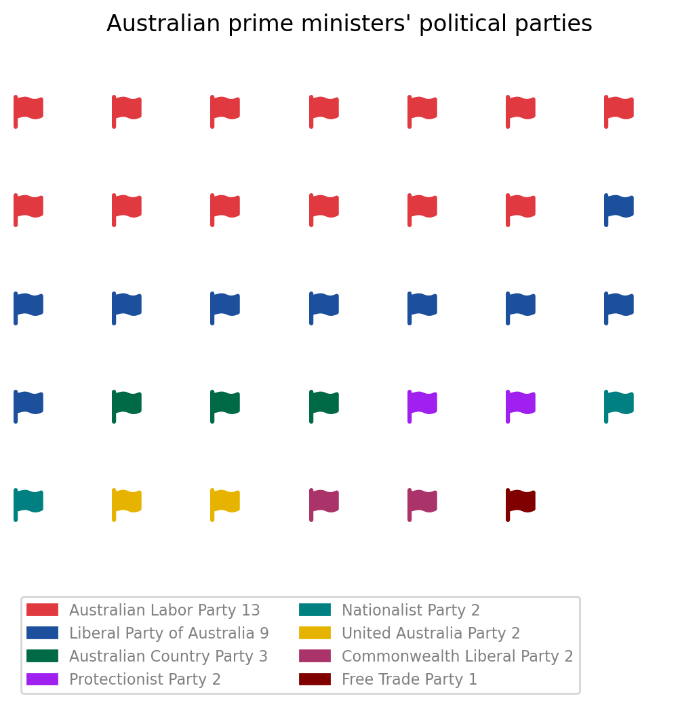

Title: A look at the political parties of Australia's prime ministers
Date: 2023-03-24
Category: Blog
Tags: data-visualisation, waffle-chart, pictogram

<style>
img {
  border: 1px solid #BFBFBF;
}
</style>

With the NSW election coming up this weekend I've had politics on my mind. 

I was curious to see how many prime ministers we've had from which political parties:



Australians who know their history might note that we've only had 31
prime ministers while in this pictogram there are 34 political parties listed.

Why is this?

What I was suprised to learn was that there have been a few prime ministers whose
political party changed:

- Alfred Deakin was first elected PM in the 1903 election when he was leader of the Protectionist Party. He retains the top job in the 1906 election but after political squabbling he is replaced by Labor's Andrew Fisher. Alfred later takes back the PM role as head of the Commonwealth Liberal Party.

- Labor is voted to power in 1906 and William Hughes is elected PM after Andrew Fisher resigns due to ill health. William is later expelled from the Labor party but becomes PM again after joining the Nationalist party.

- In the 1940 election Robert Menzies became PM as head of the United Australia Party. The UAP is dissolved in 1945 and Robert is elected PM again in 1949
as head of the Liberal Party of Australia.

### Data source

- [The National Archives of Australia](https://www.naa.gov.au/explore-collection/australias-prime-ministers)
- [Wikipedia](https://en.wikipedia.org/wiki/List_of_Australian_federal_elections)

### How I did it

I used the [PyWaffle](https://pywaffle.readthedocs.io/en/latest/) library to create the pictogram/waffle chart.


``` python
from pywaffle import Waffle
import matplotlib.pyplot as plt

data = {'Australian Labor Party':13, 'Liberal Party of Australia':9,
'Australian Country Party':3, 'Protectionist Party':2, 'Nationalist Party': 2,
'United Australia Party': 2, 'Commonwealth Liberal Party':2, 'Free Trade Party':1}
colours = ['#E13940', '#1C4F9C','#006946', '#A020F0','#008080',
'#E6B400', '#AA336A', '#800000']

fig = plt.figure(
    FigureClass=Waffle,
    columns=7,
    starting_location='NW',
    vertical=True,
    values=data,
    colors=colours,
    icons='flag',
    font_size=18,
    title={'label': 'Australian prime ministers\' political parties'},
    labels = [f"{k} {v}" for k, v in data.items()],
    legend=
        {
        'loc': 'upper left',
        'bbox_to_anchor': (0, -0.15),
        'ncols':2,
        'fontsize': 8,
        'labelcolor':'#808080'
        }
    )

fig.savefig("aus_political_parties.png", dpi=200, bbox_inches="tight")
```


